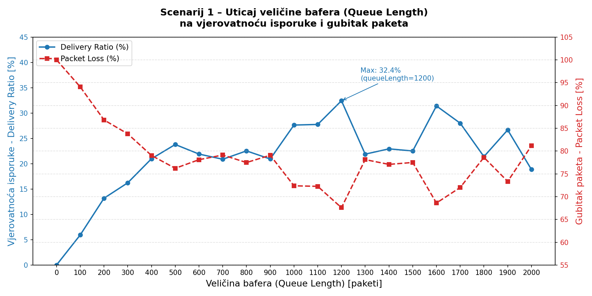
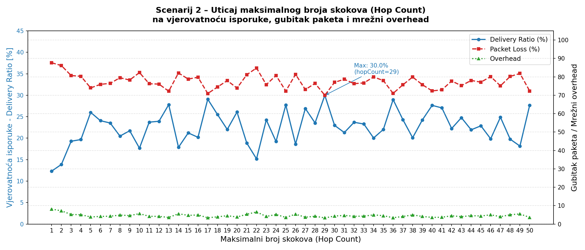
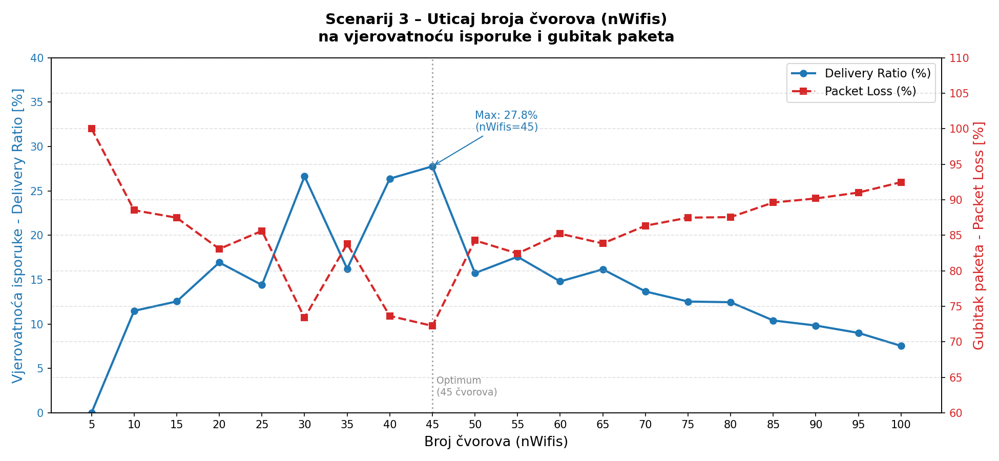
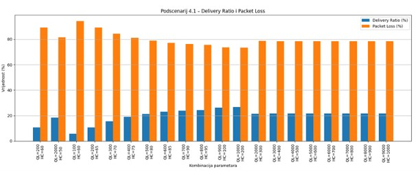
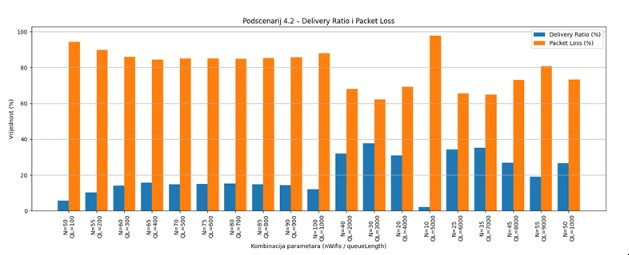
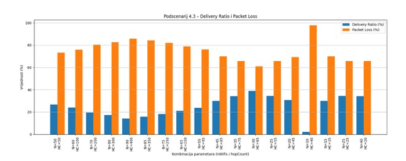

# Epidemic Routing Protocol – NS-3 Simulacija

> Simulacija i analiza Epidemic Routing protokola u NS-3 simulatoru za DTN mreže  


## 📌 O projektu

Ovaj projekat istražuje performanse **Epidemic Routing protokola** u mrežama otpornim na kašnjenje (Delay-Tolerant Networks – DTN). Epidemic routing jedan je od prvih i najznačajnijih algoritama baziranih na replikaciji podataka, koji koristi **Store-Carry-Forward** mehanizam za prenos poruka u okruženjima bez stalne mrežne povezanosti.

Projekt je razvijen na osnovu postojeće implementacije Epidemic Routing Protocol za ns-3, dostupne na GitHub repozitoriju: https://github.com/Herbrant/epidemic-ns3. Izvorna implementacija korištena je kao polazna osnova, dok su u okviru ovog projekta izvršene dodatne izmjene i proširenja radi implementacije novih benchmark scenarija, prikupljanja statističkih podataka i analize performansi protokola.

Projekt se sastoji od dva dijela:
- **Teorijski dio** – analiza arhitekture DTN mreža, principa rada Epidemic protokola i poređenje sa srodnim protokolima (Spray and Wait, PRoPHET)
- **Praktični dio** – implementacija i simulacija u NS-3 okruženju kroz više scenarija

### Modifikacije implementirane u `epidemic-ns3`

U okviru ovog projekta izvršene su izmjene nad izvornom implementacijom Epidemic Routing protokola za ns-3. Glavni dio implementacije nalazi se u datoteci **`epidemic-benchmark.cc`**, koja predstavlja ulaznu tačku za pokretanje svih benchmark scenarija. Iz ove datoteke vršeno je pokretanje i konfiguracija svih eksperimenata korištenih u projektu.

Implementirane izmjene uključuju:

* **Queue Length Benchmark** – analiza uticaja veličine reda čekanja (`queueLength`) na isporuku poruka, mrežni overhead i kašnjenje.
* **Hop Count Benchmark** – analiza uticaja maksimalnog broja skokova (`hopCount`) na performanse protokola.
* **Node Count Benchmark** – analiza uticaja broja čvorova (`nWifis`) na uspješnost isporuke poruka i opterećenje mreže.
* **Manual Benchmark** – kombinovani scenariji za ispitivanje međusobnog uticaja više parametara (broj čvorova, veličina reda čekanja i maksimalni broj skokova).

**`epidemic-benchmark.cc`** korišten je za odabir i pokretanje odgovarajućih benchmark scenarija (`queue-length`, `hop-count`, `node-count` i `manual`), dok su pojedinačne implementacije benchmarka smještene u direktoriju **`benchmark/`**. Dodatno, izvršene su izmjene u implementaciji protokola radi prikupljanja statističkih podataka, generisanja rezultata u CSV formatu i omogućavanja detaljne analize performansi kroz pripadajuće skripte i grafičke prikaze.

## Video demonstracije
Za potrebe projekta pripremljene su i video demonstracije koje prikazuju praktičan rad implementiranih scenarija.

Video zapisi obuhvataju:

- pokretanje benchmark scenarija u NS-3 okruženju,
- izvršavanje simulacija Epidemic Routing protokola,
- analizu razmjene paketa pomoću Wireshark alata,
- prikaz komunikacije između čvorova i potvrdu ispravnog rada implementiranih modifikacija.

Video demonstracije su dostupne putem Google Drive linka: (https://drive.google.com/drive/folders/1EWF6363NiKQEyDqYXPwJnRzYqo-RHR73?usp=sharing)


## 📁 Struktura repozitorijuma

```
Epidemic-Routing-Protocol/
│
├── scenariji/
│   ├── prvi_scen.csv
│   ├── scenarij2_hopcount.csv
│   ├── treci_scenarij_broj_cvorova.csv
│   └── manual_results.csv
│
├── kod/
│   ├── I-scenariji/
│   │   └── scenarij1_queue_length.py
│   ├── II-scenariji/
│   │   └── scenarij2_hopcount.py
│   ├── III-scenariji/
│   │   └── scenarij3_broj_cvorova.py
│   └── IV-scenariji/
│       └── scenarij4_svi.py
|   └── epidemic-ns3
|       └── benchmark
|       └── epidemic-benchmark.cc
│
├── grafici/
│   ├── I-scenariji/
│   │   └── scenarij1_queue_length.png
│   ├── II-scenariji/
│   │   └── scenarij2_hopcount.png
│   ├── III-scenariji/
│   │   └── scenarij3_broj_cvorova.png
│   └── IV-scenariji/
│       ├── scenarij4_1_queue_hop.png
│       ├── scenarij4_2_nodes_queue.png
│       └── scenarij4_3_nodes_hop.png
│
├── izvjestaji/
│   └── KUTM.pdf
│
└── README.md
```

---

## 🔬 Simulacijski scenariji

Simulacija je provedena na modelu DTN mreže sa **50 mobilnih čvorova** u prostoru dimenzija 1500 m × 300 m, uz korištenje Random Waypoint modela mobilnosti.

### Scenarij 1 – Uticaj veličine bafera (Queue Length)

- Parametar `queueLength` mijenjan u opsegu od 0 do 2000 paketa
- **Najbolji rezultat:** Delivery Ratio = **32.4%** pri `queueLength = 1200`



---

### Scenarij 2 – Uticaj broja skokova (Hop Count)

- Parametar `hopCount` mijenjan u opsegu od 1 do 50
- **Najbolji rezultat:** Delivery Ratio = **30.0%** pri `hopCount = 29`



---

### Scenarij 3 – Uticaj broja čvorova

- Parametar `nWifis` mijenjan u opsegu od 5 do 100 čvorova
- **Najbolji rezultat:** Delivery Ratio = **27.8%** pri `nWifis = 45`



---

### Scenarij 4 – Kombinovani uticaj parametara

| Podscenarij | Optimalni parametri | Max Delivery Ratio | Min Packet Loss |
|---|---|---|---|
| 4.1 – Bafer + Hop Count | queueLength=1000, hopCount=200 | 26.6% | 73.4% |
| 4.2 – Čvorovi + Bafer | nWifis=30, queueLength=3000 | 37.8% | 62.2% |
| 4.3 – Čvorovi + Hop Count | nWifis=30, hopCount=65 | **39.0%** | **61.0%** |





---

## 📊 Ključni zaključci

- Povećanje kapaciteta bafera poboljšava performanse do određene granice, nakon koje dolazi do zasićenja
- Optimalan broj čvorova za posmatrani scenarij iznosi **30–45**, nakon čega intenzivna replikacija degradira performanse
- Kombinovana optimizacija više parametara daje bolje rezultate od optimizacije jednog parametra
- **Packet loss** u svim scenarijima ostaje iznad 60%, što je karakteristika Epidemic Routing protokola zbog intenzivnog "plavljenja" (flooding overhead)
- Rezultati su konzistentni s teorijskim SI modelom širenja poruka

---

## 📄 Dokumentacija

- [Teorijski izvještaj](izvjestaji/KUTM.pdf)
- [Praktični izvještaj](izvjestaji/KUTM_prakticni_dio.pdf)

---

## 📚 Literatura

1. Vahdat, A. and Becker, D. (2000). *Epidemic routing for partially connected ad hoc networks.* Duke University.
2. Herbrant, *Epidemic Routing ns-3 Benchmark Implementation*, GitHub.
3. Fall, K. (2003). *A delay-tolerant network architecture for challenged internets.* SIGCOMM.
4. Spyropoulos et al. (2005). *Spray and Wait.* ACM SIGCOMM.
5. Lindgren et al. (2003). *PRoPHET: Probabilistic routing in intermittently connected networks.* ACM SIGMOBILE.
6. Yulianti et al. (2020). *Performance comparison of epidemic, prophet, spray and wait, binary spray and wait, and prophetv2.* UTM Malaysia.
